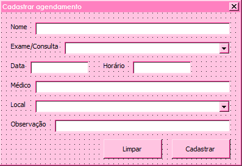

  
  
  
   
  

# Planilha de agendamento de consulta em Excel Macro
<h4 align="center"> 
	✅ Planilha Concluída ✅
</h4>

##  Planilha em excel com botão macro que insere dados para agendamento de consulta como especialidades, exames, local da realização do exame, data e horário. 

 <a href="#objetivo">Objetivo</a> •
 <a href="#imagens">Imagens</a> •  
 <a href="#licença">Licença</a> • 
 <a href="#autor">Autor</a> • 
 <a href="#readme">Versões do README</a>

## Objetivo
Essa planilha foi criada na época em que eu estagiava em um centro de infecctologia e senti a necessidade de facilitar algumas das minhas principais funções lá dentro, o cadastro dos agendamentos em uma planilha para que eu pudesse ter controle do que estava fazendo e ciência de todos os agendamentos que chegava até mim. 

A ideia foi muito bem abraçada por meus supervisores pois todo o processo do agendamento ainda tinha muitas falhas que não só dependiam da nossa unidade e sim de todas as unidades de saúde da prefeitura da cidade. 

Além disso, era um documento simples que era possível que outras pessoas com diferentes tipos de conhecimento com excel ou computadores no geral, pudessem utilizar o mesmo arquivo sem trazer nenhum problema com a formatação ou coisas escritas em lugares errados.
  
As especialidades, exames e local da realização foram já pré-cadastradas para uso pessoal na época em que eu fazia estágio em um centro clínico, porém é possível adicionar ou remover dados através das macros feitas.

 ***
 ## Imagens
 Através de um botão visto no topo da planilha, é possível abrir esse formulário e é aqui que é possível cadastrar os agendamentos que chegava para mim no estágio.

 

## Autor
---
 
  
 <b>Vitória Garrucho</b>

Feito com ❤️ por Vitória Garrucho

Entre em contato através das minhas redes sociais!

  

***
## Licença

Este projeto esta sobe a licença [MIT](./LICENSE).

Feito com ❤️ por Vitória Garrucho

[Entre em contato!](https://www.linkedin.com/in/vitoriagarrucho/)
***
## README
[Português](./README.md)  |  [English](./README-en.md)
